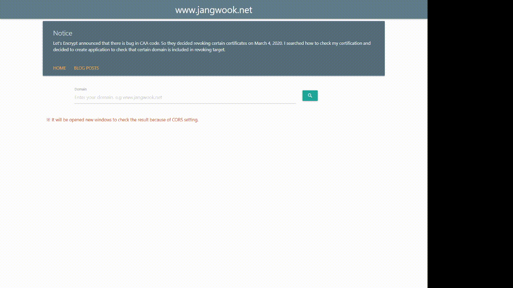

# Let's Encrypt Domain Checker



Let's Encrypt announced that there is bug in CAA code.

So they decided revoking certain certificates on March 4, 2020.

I searched how to check my certificate and decided to create application to check that certain domain is included in revoking target.

## 2020.03.07

Let's Encrypt announced they don't revoke certification.

But safety of the SSL certificates remains, so you should check your domain.

## How to run

```js
$ node -v
v12.16.1

$ npm install

$ npm run dev
```
